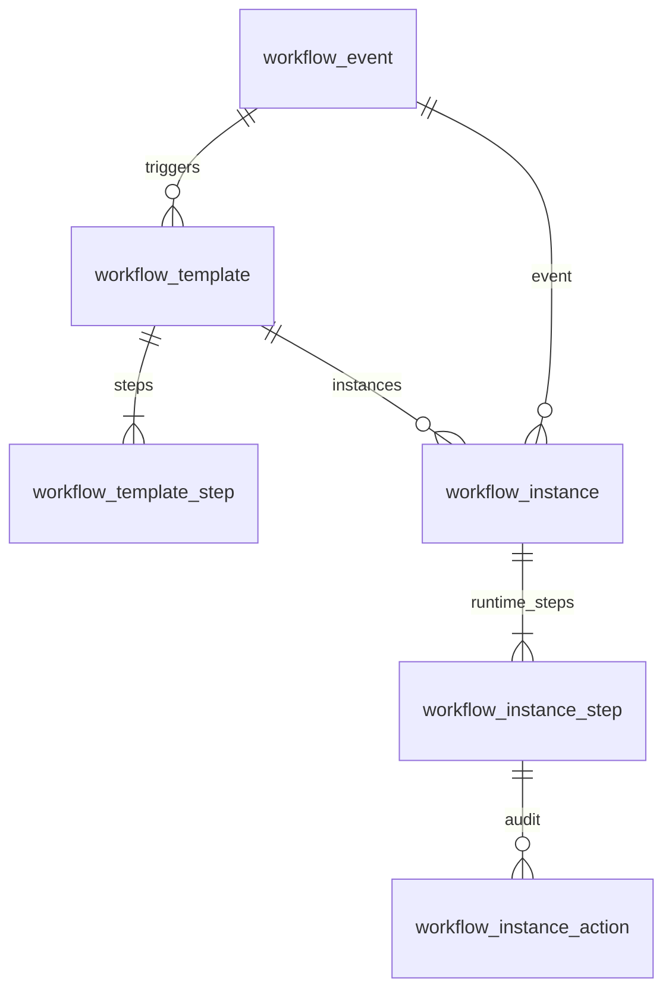
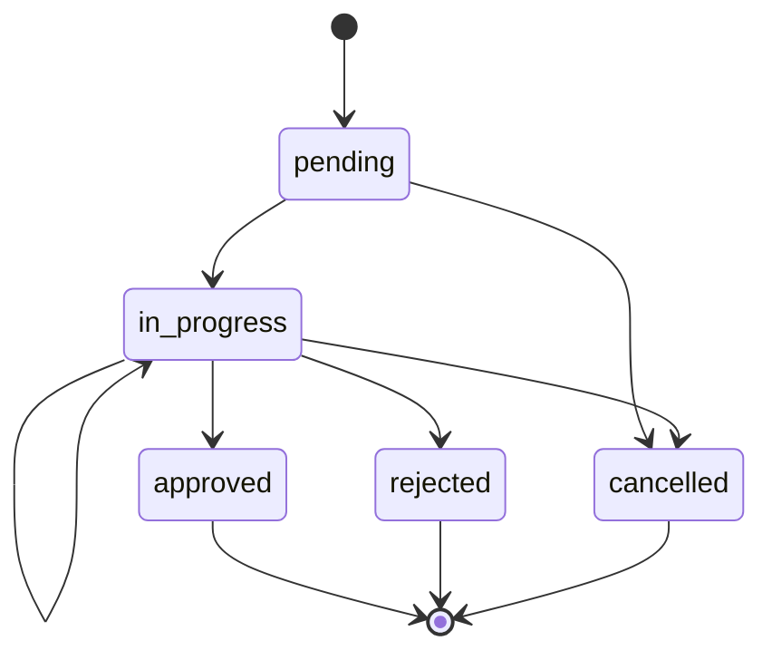
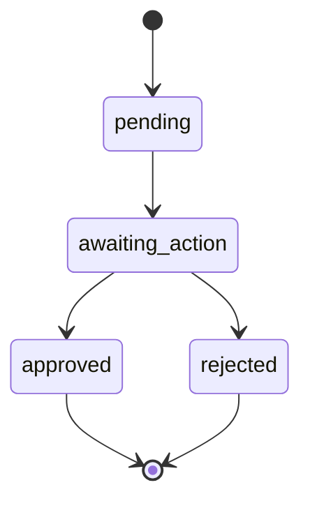

# Workflow engine — Part 1: schema and design

Configurable approval workflows: **templates** (admin configuration) versus **instances** (runtime). PostgreSQL is assumed for partial unique indexes and constraints.

- **DDL:** `database/migrations/001_workflow_engine.sql`
- **Optional catalog seed:** `database/seeds/001_workflow_events.sql`
- **Types (reference):** `src/workflow/types.ts`

Apply migration then seed:

```bash
psql "$DATABASE_URL" -f database/migrations/001_workflow_engine.sql
psql "$DATABASE_URL" -f database/seeds/001_workflow_events.sql
```

## Entity relationship (summary)



## 1.1 Workflow template configuration

- `workflow_event`: predefined trigger catalog (`code`, e.g. `booking.cancellation_requested`).
- `workflow_template`: `name`, `description`, `event_id`, `version`, `status`, `is_active`.
- `workflow_template_step`: ordered `sequence`; `approver_kind` `USER` or `ROLE` with XOR check on `user_id` / `role_id`.

**One active template per event:** partial unique index `uq_workflow_template_one_active_per_event` on `workflow_template(event_id)` where `is_active` is true and `status` is `PUBLISHED`.

**Versioning:** `UNIQUE (event_id, version)` on `workflow_template`; instances store `template_version` at creation time.

## 1.2 Workflow instance (runtime)

- `workflow_instance`: polymorphic `entity_type` + `entity_id`; overall `status`; `initiated_by`; `template_id` + `template_version`; optional `current_step_sequence`.
- `workflow_instance_step`: snapshot of template step at creation; per-step `status`; `lock_version` for concurrent approvals (see 1.5).
- `workflow_instance_action`: audit: `actor_user_id`, `decision` (`approve` / `reject`), `comment`, `acted_at`.

**Rejection:** on reject, set instance `rejected`, mark step `rejected`, insert action row, do not advance later steps. **Notify initiator** using `initiated_by` (out of band).

## 1.3 Example: booking cancellation

1. Coordinator requests cancellation: emit `booking.cancellation_requested`.
2. Resolve active published template for that event; create `workflow_instance` (`entity_type` = Booking, `entity_id` = booking id, `initiated_by` = coordinator).
3. Materialize instance steps from template (e.g. Sales Manager role step 1, Finance Manager user step 2).
4. On final approve: instance `approved`; domain layer sets booking cancelled and unit available.
5. On reject: instance `rejected`, booking unchanged, notify `initiated_by`.

## 1.4 Schema requirements

| Requirement | Mechanism |
|-------------|-----------|
| DDL / migration | `001_workflow_engine.sql` |
| PKs / FKs | Surrogate keys; FKs as in migration |
| Indexes | Partial indexes on pending user/role steps; see migration |
| One active template per event | Partial unique index (1.1) |
| Polymorphic source | `entity_type`, `entity_id` on `workflow_instance` |
| Audit trail | `workflow_instance_action` |

**Pending work for user or role:** `idx_workflow_instance_step_pending_user` and `idx_workflow_instance_step_pending_role`. Join role steps to the current user's roles via your `user_roles` table at query time.

## 1.5 Written explanation

### Mid-workflow role change

**Snapshot at instance creation.** Instance steps copy approver fields from the template when the instance is created. A **user** step stays on that `user_id`. A **role** step still means anyone with that role may act; current membership is checked when submitting an action, but the step is not reassigned to a different role unless you add an explicit reassign feature.

### Two approvers on the same step

**Optimistic locking** on `workflow_instance_step.lock_version`. Approve or reject runs:

`UPDATE ... SET status = ..., lock_version = lock_version + 1 WHERE id = ? AND status = 'awaiting_action' AND lock_version = ?`

If zero rows updated, another transaction won the race. Optionally use `SELECT ... FOR UPDATE` on the step in the same transaction.

### Bonus: parallel steps (2a and 2b before step 3)

Add **stages:** e.g. `workflow_template_stage` (`template_id`, `stage_order`). Multiple `workflow_template_step` rows share one `stage_id` for parallel branches; the engine requires **all** steps in that stage to be `approved` before opening the next `stage_order`. Runtime can mirror with `workflow_instance_stage` or derive completion from child instance steps.

## Instance lifecycle (state machine)





## Platform tables

`user_id`, `role_id`, `actor_user_id`, `initiated_by` are `BIGINT` placeholders; add FKs to `users` and `roles` when available.


---

# Part 2: REST API (Fastify)

Implementation: TypeScript + Fastify + `pg`. Run `npm install`, apply migrations `001` and `002`, set `DATABASE_URL`, then `npm run dev`.

## Concurrency

Approvers send `lockVersion` from the inbox or instance detail response. The service updates a step only if `status = awaiting_action` **and** `lock_version` matches, then increments `lock_version`. If zero rows are updated, the API returns **409** with code `STEP_CONCURRENCY_CONFLICT` (two role members submitted at the same time; one wins).

## Domain callbacks (side effects)

Register handlers in `src/index.ts` via `registerOnFinalApproval` / `registerOnRejected`. They run **after** the database transaction commits. Example: on `booking.cancellation_requested` final approval, update booking and unit; on rejection, notify `initiatedBy`.

## Endpoints

| Method | Path | Purpose |
|--------|------|---------|
| POST | `/api/v1/workflow/templates` | Create template + steps. Body: `name`, `description?`, `eventCode`, `activate` (boolean), `steps[]` (`sequence`, `approverKind`, `userId?`, `roleId?`). **409** `TEMPLATE_EVENT_CONFLICT` if `activate` and event already has an active template. |
| GET | `/api/v1/workflow/templates/:templateId` | Full template + steps. |
| PATCH | `/api/v1/workflow/templates/:templateId` | Update `name`, `description`, and/or replace `steps`. **409** `TEMPLATE_HAS_RUNNING_INSTANCES` if any instance is `pending` or `in_progress`. |
| POST | `/api/v1/workflow/templates/:templateId/activation` | Body: `{ "active": boolean }`. Activating publishes if needed and checks no other active template for the event. **409** on conflict. |
| POST | `/api/v1/workflow/instances` | Trigger workflow. Body: `eventCode`, `entityType`, `entityId`, `initiatedBy`. **404** `NO_ACTIVE_TEMPLATE`. **409** `INSTANCE_ENTITY_CONFLICT` with `details.existingInstanceId` if an open instance exists for the entity. |
| GET | `/api/v1/workflow/instances/:instanceId` | Instance + steps + action history (audit). |
| GET | `/api/v1/workflow/inbox?userId=&roleIds=` | Pending steps for approver. `roleIds` optional, comma-separated (e.g. `2,3`). |
| POST | `/api/v1/workflow/instance-steps/:stepId/approve` | Body: `actorUserId`, `lockVersion`, `comment?`, `roleIds?` (array or comma string of roles the actor holds). **403** if not assignee. **409** if step not `awaiting_action` or concurrency lost. **204** on success. |
| POST | `/api/v1/workflow/instance-steps/:stepId/reject` | Body: `actorUserId`, `lockVersion`, `comment` (required), `roleIds?`. Same errors. **400** if comment empty. |

## HTTP status summary

- **201** create resource  
- **204** success, no body  
- **400** validation (e.g. reject without comment)  
- **403** not an assignee  
- **404** not found / no active template / unknown event  
- **409** business conflict (template/event, open instance, wrong step state, concurrency)  
- **500** unexpected error  

Error body: `{ "error": { "code", "message", "details?" } }`.
